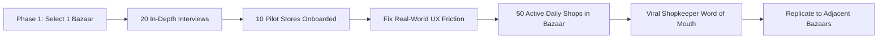

# Go-to-Market & Field Pilot Playbook

## 1. The "Single Bazaar" Expansion Framework

---

## 2. Step-by-Step Field Execution

### Step 1: Pre-Seeded Catalog Strategy (The Aha! Moment)
* Never hand a shopkeeper an empty database where they have to type 2,000 products manually.
* When a shop selects **Grocery**, we pre-load **5,000 standard BD products** (Lux Soap, Radhuni Haldi, Teer Oil) with barcodes and MRP. The shopkeeper simply scans the barcode and starts selling in 10 seconds!

### Step 2: On-the-Spot 5-Minute Onboarding
1. Field agent installs app on shopkeeper's phone.
2. Selects business category (e.g. Pharmacy / Grocery).
3. Adds 1 test sale, 1 customer due, scans 1 barcode.
4. Prints a sample receipt on mini Bluetooth printer.
5. Gives 30-day Free Trial.

### Step 3: The "Khata Transfer" Onboarding Assist
* Field agent sits with the shopkeeper for 15 minutes and helps enter their existing active due customers from paper notebook into the app.
* Once the customer receives their first automated SMS due receipt, the shopkeeper is hooked forever.
