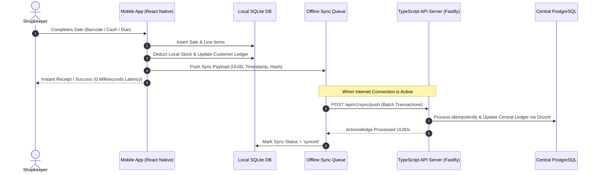

# Offline-First & Data Sync Engine

## 1. The Offline-First Paradigm
In rural markets, internet connectivity drops frequently during power outages (লোডশেডিং). The mobile application **must never block a sale** due to lack of network.

---

## 2. Conflict Resolution Strategy (LWW + Sequence Clocks)
* **Master Records (Products / Customers):** Last-Write-Wins (LWW) based on verified UTC millisecond timestamps.
* **Transactional Records (Sales / Payments / Stock Deductions):** Append-only event ledger. Every sale event has a client-generated UUID `client_transaction_id`. The server processes each sync event idempotently using unique constraint checks.
