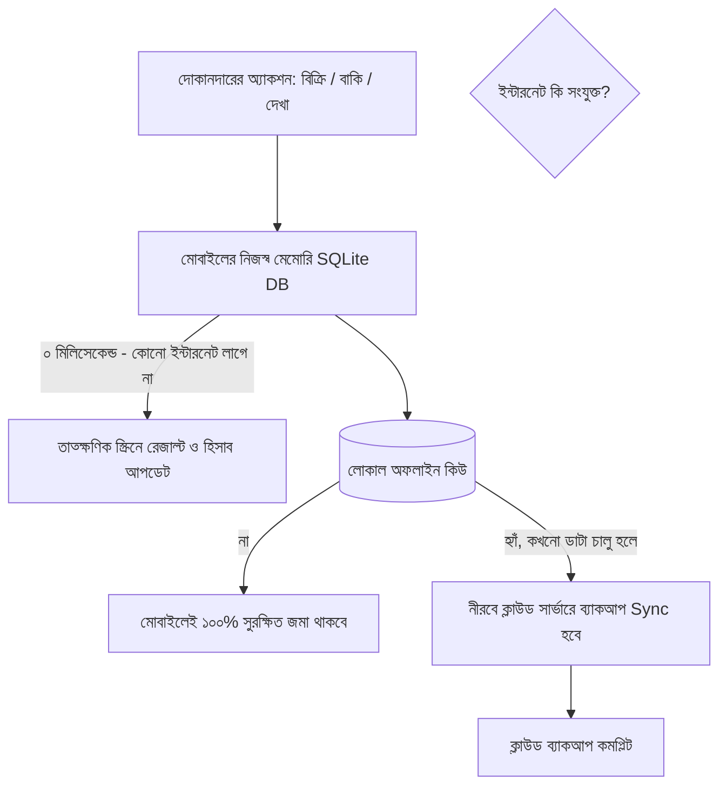

# Zero-Internet Standalone Offline Engine (সম্পূর্ণ ইন্টারনেটবিহীন অফলাইন ইঞ্জিন)

> **Core Rule:** ইন্টারনেট থাকা বা না থাকার ওপর কোনো ফিচার নির্ভর করবে না। **ইন্টারনেট ছাড়া সমস্ত হিসাব দেখা, বিক্রি করা, বাকি লেখা, স্টক চেক করা এবং লাভ-ক্ষতি হিসাব ১০০% অফলাইনে চলবে।**

---

## 📵 ১. কেন ১০০% অফলাইন অপরিহার্য? (Ground Reality in Rural BD)

1. **ঘন ঘন লোডশেডিং ও নেটওয়ার্ক ড্রপ:** গ্রামের বাজারে বিদ্যুৎ গেলে মোবাইল টাওয়ারের 4G/3G সিগন্যাল বন্ধ হয়ে যায়।
2. **ডাটা প্যাক না থাকা:** অনেক দোকানদারের ফোনে সার্বক্ষণিক মেগাবাইট (ইন্টারনেট প্যাক) থাকে না।
3. **কাস্টমারের ভিড়ে জিরো লোডিং:** কাস্টমার দাঁড়িয়ে থাকা অবস্থায় যদি সফটওয়্যার ২ সেকেন্ডও লোডিং স্পিনার দেখায়, দোকানদার সফটওয়্যার বন্ধ করে খাতায় ফিরে যাবেন।

---

## 💾 ২. ইন্টারনেট ছাড়া যা যা দেখা ও করা যাবে (100% Offline Capabilities)

```
+-------------------------------------------------------------------------+
|                  📶 [ অফলাইন মোড — সম্পূর্ণ সচল ]                        |
+-------------------------------------------------------------------------+
|  ✅ ইন্টারনেট ছাড়াই সাথে সাথে দেখা যাবে:                                 |
|     • সম্পূর্ণ বাকি খাতা (কার কাছে কত টাকা বাকি আছে)                     |
|     • দোকানের সমস্ত পণ্যের তালিকা, স্টক ও কেনা-বেচার দাম                |
|     • আজকের মোট বিক্রি, নগদ জমা, খরচ এবং আসল নিট লাভ                    |
|     • কাস্টমার ও মহাজনদের ফোন নাম্বার ও আগের লেনদেনের হিস্ট্রি          |
|                                                                         |
|  ✅ ইন্টারনেট ছাড়াই কাজ করবে:                                            |
|     • নতুন পণ্য বিক্রি (ক্যাশ / বিকাশ / বাকি)                            |
|     • ক্যামেরায় বারকোড স্ক্যান                                           |
|     • বাকির খাতায় নতুন বাকি যোগ করা ও টাকা উসুল (আদায়) করা              |
|     • নতুন পণ্য এন্ট্রি ও স্টক বাড়ানো/কমানো                             |
|     • ব্লুটুথ মেশিনে রসিদ বা মেমো প্রিন্ট                                |
|     • দিনের হিসাব ক্লোজ করা                                             |
+-------------------------------------------------------------------------+
```

---

## ⚙️ ৩. টেকনিক্যাল আর্কিটেকচার (How It Works Technically)



1. **লোকাল মাস্টার ডাটাবেজ (On-Device SQLite):**
   - সমস্ত প্রোডাক্ট, কাস্টমার, সেলস এবং বাকির হিসাব দোকানদারের ফোনের ইন্টারনাল মেমরিতে সুরক্ষিত এনক্রিপ্টেড ডাটাবেজে থাকে।
   - এর ফলে ইন্টারনেট সম্পূর্ণ বন্ধ থাকলেও ১ মিলি-সেকেন্ডেই যেকোনো হিসাব বা বাকি দেখা যায়।

2. **নীরব ব্যাকগ্রাউন্ড ব্যাকআপ (Silent Auto-Sync):**
   - দোকানদারকে কোনো "Sync" বা "Upload" বাটনে চাপ দিতে হবে না।
   - সারাদিন অফলাইনে চলার পর রাতে বা ২ দিন পর যখনই ফোনে ১ মিনিটের জন্য ডাটা চালু হবে বা ওয়াইফাই পাবে, অ্যাপ স্বয়ংক্রিয়ভাবে ব্যাকগ্রাউন্ডে ক্লাউডে ব্যাকআপ নিয়ে নেবে।

3. **ফোন হারিয়ে গেলে ডাটা রিকভারি:**
   - মোবাইল নষ্ট বা চুরি হয়ে গেলে নতুন ফোনে শুধু নিজের মোবাইল নাম্বার দিয়ে লগইন করলেই পূর্বের সমস্ত হিসাব ও খাতা ফেরত চলে আসবে।
