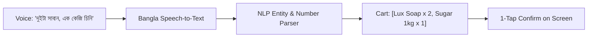

# Smart Feature: Bangla Voice Sale Input

## 1. How It Works

* **Local Token Lexicon:** Trained on common local product terminology (সাবান, চিনি, ডাল, তেল, নাপা, ডিম).
* **Confidence Guardrail:** Always shows a visual preview on screen for 1-tap confirmation before committing transaction.
