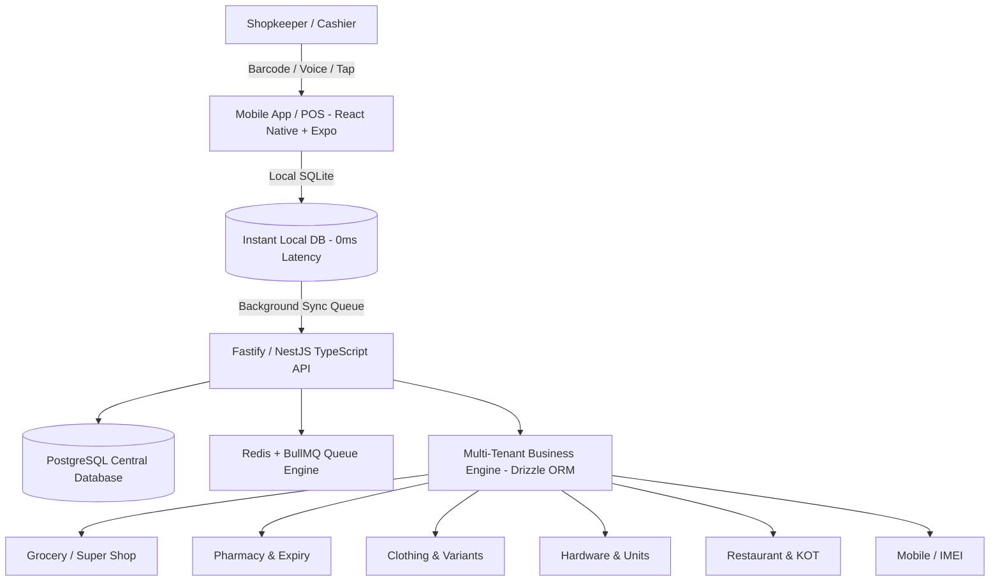

# LOCAL BUSINESS OS (লোকাল বিজনেস ওএস)
### Full-Stack TypeScript Multi-Industry Retail & Business Management SaaS for Bangladesh

> **Core Positioning:** *"দোকানদার ব্যবসা করবে, হিসাব Software নিজেই করবে।"*  
> An ultra-simple, offline-first, low-cost operating system engineered specifically for village bazaars, upazilas, and small-town retailers across Bangladesh.

---

## 📌 Executive Overview

**Local Business OS** is a unified multi-tenant SaaS built on a **100% Full-Stack TypeScript Ecosystem** (React Native Mobile + Next.js Web + Fastify/NestJS API + Drizzle ORM + PostgreSQL).

Instead of forcing non-tech-savvy rural shopkeepers to behave like corporate accountants, the system eliminates manual data friction through **Barcode Scanning, One-Tap Quick Sales, Bangla Voice Input, and Supplier Invoice Photo OCR**.

---

## 🗂️ Complete Documentation Suite

This project contains the complete business, product, architecture, and operational blueprints:

| Folder / Module | Focus Area | Description |
|---|---|---|
| [**01-product-strategy/**](./01-product-strategy/) | Product Vision & Business Model | Market sizing, user personas, tiered subscription pricing (৳49–৳199/mo), unit economics & ground pilot strategy. |
| [**02-system-architecture/**](./02-system-architecture/) | Tech Architecture & Data Models | Full-Stack TypeScript architecture, multi-tenancy with Drizzle ORM, offline sync engine (SQLite ↔ PostgreSQL), ERD schemas. |
| [**03-core-modules-and-workflows/**](./03-core-modules-and-workflows/) | Core Business Engine | 3-tap POS sales flow, universal inventory formula, customer/supplier khata ledger, automated profit/loss calculation. |
| [**04-industry-category-engines/**](./04-industry-category-engines/) | Industry-Specific Logic | Dedicated modules for Grocery, Pharmacy (Batch/Expiry), Clothing (Matrix), Hardware (Units), Restaurant (KOT), Mobile (IMEI). |
| [**05-ai-voice-and-smart-inputs/**](./05-ai-voice-and-smart-inputs/) | Frictionless Smart Inputs | Smartphone-first UX, zero-typing Bangla voice sale parser, supplier invoice photo OCR pipeline, predictive reordering. |
| [**06-roadmap-and-execution/**](./06-roadmap-and-execution/) | 12-Week MVP & Scale Plan | Phased rollout plan, risk mitigation matrix, field sales playbooks, and North Star KPI dashboards. |

---

## ⚡ Key Differentiators & Competitive Advantage

1. **Full-Stack TypeScript Monorepo:** Shared types, Zod schemas, and models across Mobile, Web Dashboard, and Backend API.
2. **Category Dynamic UI:** A pharmacy sees generic names & batch expiries; a cloth shop sees size/color matrix; a grocery store sees instant barcode search. One codebase, infinite business flavors.
3. **True Offline-First:** Rural internet cuts out? No problem. Shopkeepers can continue selling, recording dues, and taking stock without internet. Syncs silently when connection returns.
4. **Bangla-First Simplicity:** Large touch targets, Bangla voice search, zero jargon (ডেবিট/ক্রেডিট এর বদলে জমা/খরচ/বাকি).
5. **Disruptive Pricing:** Starts at only ৳49/month (less than the cost of 2 cups of tea per day), driving viral word-of-mouth adoption in local markets.
